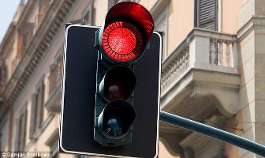

#### wait-for-weave

Small golang binary that will block until weave network is connected.

Will run command line arguments once weave network connects.

https://github.com/binocarlos/wait-for-weave